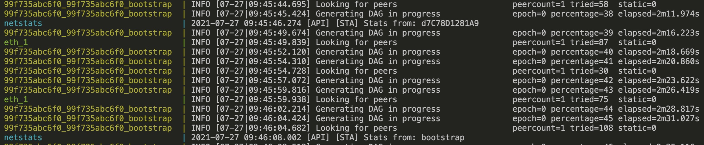
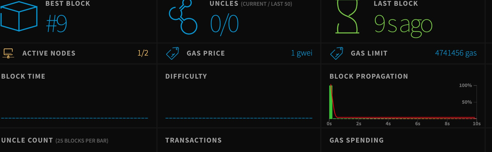

# Ethereum Docker

[ethereum-docker](https://github.com/Capgemini-AIE/ethereum-docker)

## Getting started

```sh
mkdir -p data/{bootstrap,eth} 
```

## [Setup bootnode](https://geth.ethereum.org/docs/getting-started/private-net)

### genkey

> bootnode -genkey bootnode.key

```sh
b05a7c015501ce6c428844df2ff4cd63c98a9231987508430d51075a2e59faf6
```

### nodekeyhex

> bootnode -nodekeyhex b05a7c015501ce6c428844df2ff4cd63c98a9231987508430d51075a2e59faf6

```sh
enode://90168cc33f18e900606ccfd62f72d10c90d21f03463a8b083d6d92fa4545b6551312f75551d47d53b166aa918ac7495dba087effc3408c2da0c716c9022f10b3@127.0.0.1:0?discport=30301
Note: you're using cmd/bootnode, a developer tool.
We recommend using a regular node as bootstrap node for production deployments.
INFO [07-27|17:27:07.377] New local node record                    seq=1 id=bf81e45805a470c5 ip=<nil> udp=0 tcp=0
```

## run compose

> docker compose up

## mining

### attach the geth

```sh
docker compose exec bootstrap bash

bash-5.1# geth attach ipc://root/.ethereum/devchain/geth.ipc
Welcome to the Geth JavaScript console!

instance: Geth/v1.10.6-unstable-f05419f0-20210715/linux-amd64/go1.16.6
at block: 0 (Tue Jul 27 2021 08:34:08 GMT+0000 (UTC))
 datadir: /root/.ethereum/devchain
 modules: admin:1.0 debug:1.0 eth:1.0 ethash:1.0 miner:1.0 net:1.0 personal:1.0 rpc:1.0 txpool:1.0 web3:1.0

To exit, press ctrl-d
```

### prepare account

```sh
> personal.newAccount()
Passphrase:
Repeat passphrase:
"0x57a15b6138cb454bdc094d90fb07adb2f52c26d4"
```

### start mining

```sh
> miner.start()
null
```

### tail logs



### web


