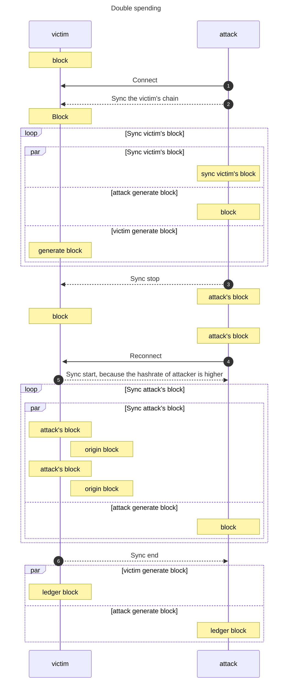

# Double spending

  Double-spending is the risk that a digital currency can be spent twice. It is a potential problem unique to digital currencies because digital information can be reproduced relatively easily by savvy individuals who understand the blockchain network and the computing power necessary to manipulate it.

## [see the sequence diagrams](https://mermaid-js.github.io/mermaid/#/sequenceDiagram?id=sequence-diagrams)

